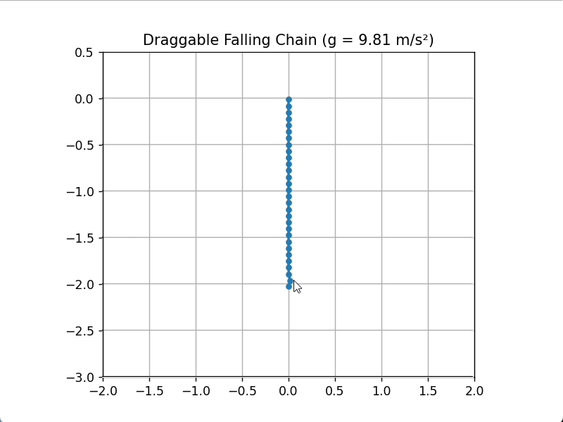

# Falling Chain Physics Simulation ⛓️


[](https://opensource.org/licenses/MIT)

A real-time physics simulation of a falling chain with adjustable gravity and interactive dragging capabilities, implemented in Python using Verlet integration.

  

## Features ✨

- **Adjustable gravity** parameter (simulate different environments)
- **Interactive dragging** of chain points with mouse
- **Constraint-based dynamics** maintaining segment lengths
- **Verlet integration** for stable numerical simulation
- **Customizable parameters** (chain length, segment count, timestep)
- **Real-time visualization** using matplotlib

## Installation ⚙️

1. Clone the repository:
```bash
git clone https://github.com/SulkBash/Chain-Simulation.git
cd Chain-Simulation
```
2. Install dependencies:
```bash
pip install -r requirements.txt
```
3. Run the simulation:
```bash
python chain.py
```

## Technical Implementation 🧠

**Key Equations**

Verlet Integration (to solve the equations of motion):

```math
x_{t+\Delta t}=2x_t-x_{t-\Delta t}+a(t)\Delta t^2
```

Distance Constraint (to maintain the chain structure):

```math
\Delta\vec{p} = \dfrac{ |\vec{p_2}-\vec{p_1}| - d }{2 |\vec{p_2}-\vec{p_1}|}  (\vec{p_2}-\vec{p_1})
```


## Dependencies 📦

- **python 3.7+**
- **NumPy**
- **MatPlotLib**

## Contributions are Welcome! 🤝
1. Fork the Repository
2. Create your feature branch (git checkout -b feature/amazing-feature)
3. Commit your changes (git commit -m 'Add some amazing feature')
4. Push to the branch (git push origin feature/amazing-feature)
5. Open a Pull Request
